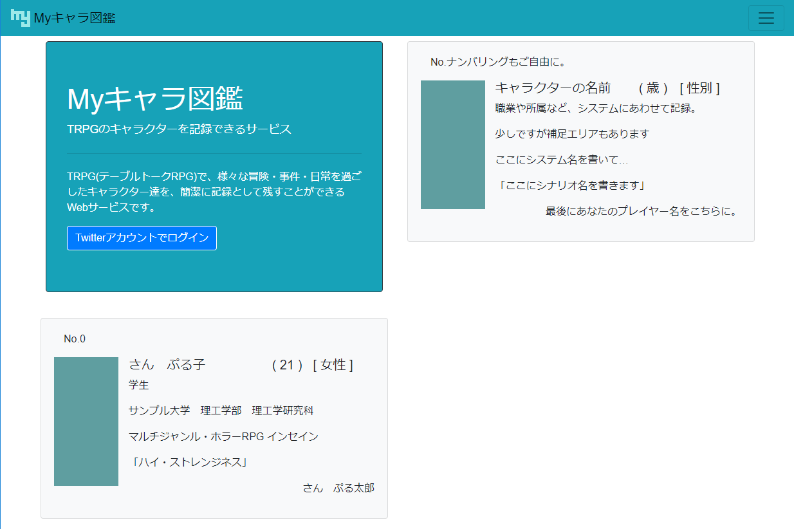
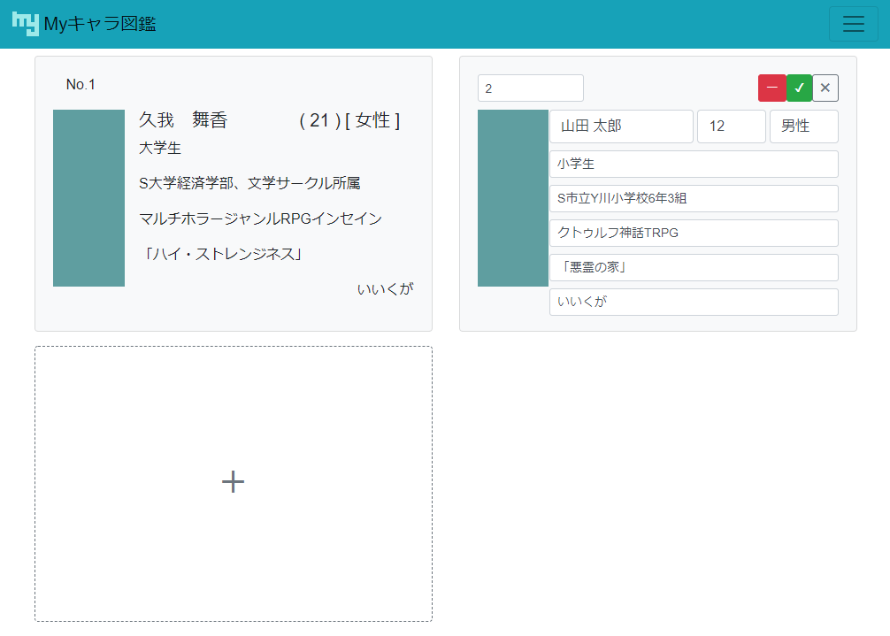

※本 Readme は、一般的な Readme の内容に準拠して記載されておらず、報告資料としての側面が強く出ています

#  My キャラ図鑑

テーブルトーク RPG（以下 TRPG）で作成したキャラクターを記録できるサービス

## 概要

TRPG とは、簡単に説明すると、「サイコロと会話で物語を作る遊び」です。  
「My キャラ図鑑」では、TRPG で作成したキャラクターの概要データを記録し、カードサイズで一覧化することができます。

**_スクリーンショット_**

**_デモ_**

[こちら](https://my-char-dictionary.firebaseapp.com/)で、Firebase Hosting を利用したデモサイトが稼働しています

## 機能

- ログイン（Twitter アカウントを利用）
- 登録済みキャラクターの一覧表示
  - キャラクターの「No」情報に基づいて昇順で表示されます
- キャラクターの登録
  - 1 つのキャラクターに以下の情報を付与することができます
    - No
    - 名前
    - 年齢
    - 性別
    - 職業
    - 補足情報
    - TRPG システム名
    - シナリオ名
    - プレイヤー名
- 登録済みキャラクターの編集
- 登録済みキャラクターの削除

## 必要要件

- このアプリケーションは、PC のブラウザからの利用が想定されています
  - 動作確認済み：Windows Chrome、IE11
  - スマートフォンからも利用は可能ですが、表示レイアウトが著しく狭くなります
- このリポジトリは個人開発アプリの記録です。クローンして利用されることを想定されていないため、以下、個人の環境に依存した記述の変更が必要となります
  - `docker-compose.yml`内、`volumes`のパスの変更
  - `src/plugins/firebase.ts`内、Firebase 環境情報の変更
    - Firebase Authentication の Twitter ログイン機能の有効化

## 利用技術

- [prott](https://prottapp.com/)
  - 仕様検討時に使用：[こちら](https://prottapp.com/p/5167fd)
- [Typescript](https://www.typescriptlang.org/)
  - メイン言語
- [Vue.js](https://jp.vuejs.org/index.html),[Vue-CLI](https://cli.vuejs.org/)v3.5.5
  - Web アプリケーションフレームワーク
  - 状態管理に[Vuex](https://vuex.vuejs.org/),ルーティングに[Vue Router](https://router.vuejs.org/)を使用
- [BootstrapVue](https://bootstrap-vue.js.org/)
  - CSS フレームワーク
- [Docker](https://www.docker.com/)
  - 開発環境の仮想化
- [Firebase](https://firebase.google.com/)
  - バックエンドの代用
  - Firebase Hosting,Firebase Authentication,Cloud Firestore を利用

## その他

- 個人開発アプリのリポジトリであるため、詳細なインストール方法は省略いたします

## 参考にした情報

このアプリケーションは、公式ドキュメントのほかに、以下 Web の情報を参考に作成しました

### Vue.js 関係

[Docker を使って Vue CLI 3 の開発環境を構築する - Qiita](https://qiita.com/satokibi/items/189945f984e5e53117ea)  
[vue.js + typescript = vue.ts ことはじめ - Qiita](https://qiita.com/nrslib/items/be90cc19fa3122266fd7)  
[TypeScript で Vue.js を書く – Vue CLI を使った開発のポイントを紹介 | maesblog](https://mae.chab.in/archives/60167#post60167-1)  
[Bootstrap を Vue.js で使ってみよう - Qiita](https://qiita.com/kurararara/items/620dd4de798a941099f5)  
[Vue.js で簡単なメモアプリを実装する - Qiita](https://qiita.com/rubytomato@github/items/294ca52abc2be4ae6131)

### Firebase 関係

[Cloud Firestore with Vue.js で簡単なメモアプリを実装する - Qiita](https://qiita.com/rubytomato@github/items/78087a2c69389f642760)  
[Vue.js における Firebase の主要な機能の取扱い - Web 系エンジニアのアウトプット練習場](https://blog.h-sakano.dev/entry/2018/12/04/000000)  
[Nuxt.js + TypeScript で Firebase Authentication を使ってみる - Web 系エンジニアのアウトプット練習場](https://blog.h-sakano.dev/entry/2018/09/19/125434)  
[h-sakano/advent-calendar-2018-app: 「Firebase Advent Calendar 2018」用のサンプルアプリ。](https://github.com/h-sakano/advent-calendar-2018-app)  
[Vue vuex で firebase のログイン保持 - Qiita](https://qiita.com/ErgoFriend/items/bd1bb445e185bf45e272)  
[Firebase apiKey ってさらしていいの? ほんとに? - Qiita](https://qiita.com/odistagon/items/e9c14ed157200b36eaa5)  
[Firebase でデプロイしたサイトを削除する方法 - Qiita](https://qiita.com/koyo-miyamura/items/be874197f8995b579e01)

### Docker Toolbox

[Docker toolbox on windows マウント：Docker コンテナの中でホストのフォルダを見たい - Qiita](https://qiita.com/hnishi/items/db10505e36c95587851d)  
[Docker-Toolbox でのシンボリックリンク - Qiita](https://qiita.com/horikeso/items/1231208252f2fbf4414c)

### VSCode

[VSCode に Code Spell Checker を導入して typo と戦う - Qiita](https://qiita.com/diescake/items/98c5a099e85775cd917d)  
[VisualStudioCode に自動整形機能があった - Qiita](https://qiita.com/maron8676/items/017cd830ab0c5fb8bcac)
